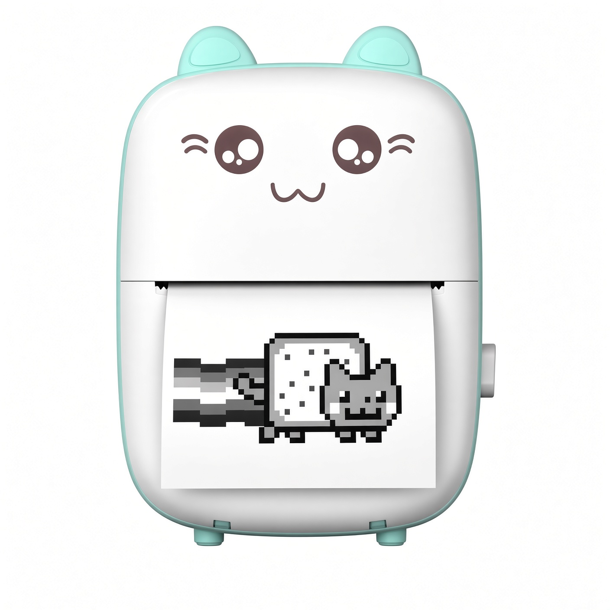

# catprinterd — because your $1 AliExpress cat printer deserves better than a mean phone app and BlueZ tantrums



*Meet the star: a pocket-sized Bluetooth thermal cat that prints other cats (Nyan!) and whatever else a kid (or tired adult) desires — once Linux is taught how to talk to it properly.*

You bought the cutest, cheapest little thermal printer on the internet. It has a face. It has ears. It costs less than lunch. And then you tried to use it on Linux.

Bluetooth Low Energy + BlueZ + combo wireless cards that secretly dislike cats + an official phone app that hogs the single connection = a special kind of chaos. An entire program had to be written so this catty device would behave like a normal printer.

**catprinterd** is that program: a small, hardened Rust daemon that turns an MXW01 (and the GB0x / GT01 / MX0x / YT01 / X5 / X6 family) into a driverless **IPP Everywhere** printer on `127.0.0.1:8095`. CUPS treats it like any modern network printer. No PPD to install, no per-user setup, works for every account on the machine, and survives reboots without anyone logging in.

```
File → Print ──► cupsd (cups-filters: your PDF/photo → PWG raster) ──► catprinterd ──► Bluetooth LE ──► 🐈 *purrs and prints*
```

### The Sacred Kid Contract 🤝

1. Bluetooth is on  
2. The cat printer is on  
3. Hit Print  

No pairing. No MAC addresses. No phone apps. That is the entire contract.

- **Hold-and-wait magic:** If the printer is off, the job waits (2 minutes by default) and the queue says *“Cat printer not found — turn it on and keep it near the computer.”* Switch it on → it prints. If the cat is already awake, the print should start in a few seconds — they nap after ~5–6 minutes of boredom, so a longer wait only blocks the queue.  
- **At home on any Linux:** One self-contained binary (glibc ≥ 2.35; built on ubuntu-22.04), two systemd units, one env file. The cat purrs on Fedora, Debian/Ubuntu, Arch, openSUSE — any systemd + CUPS distro — and is especially cozy on Immutable Fedora (nothing layered into rpm-ostree). Runtime treats: `cups`, `cups-filters`, `bluez`, `util-linux`/`rfkill`, `curl` (`avahi` optional; `policycoreutils` only where SELinux prowls). Per-distro shopping list in *Feed the cat first* below. 🍽️  
- **Model autodetect:** MXW01 (16-level grayscale) or the classic family; a new printer simply works.

## Install (admin, once per machine) — Make the cat official

**Feed the cat first** 🍽️ — the daemon needs a few treats from your package manager. It never installs them itself (a well-mannered cat doesn't raid the pantry); if one is missing, `install.sh` just prints the exact command for *your* distro.

| Distro | one-time treats |
|---|---|
| Fedora / RHEL / openSUSE | `sudo dnf install cups cups-filters bluez avahi util-linux policycoreutils curl` |
| Debian / Ubuntu | `sudo apt install cups cups-filters cups-ipp-utils bluez avahi-daemon avahi-utils rfkill curl` |
| Arch | `sudo pacman -S cups cups-filters bluez bluez-utils avahi util-linux curl` |

`avahi` is optional (it helps the cat introduce itself to the desktop); `policycoreutils` only matters where SELinux is on the prowl (Fedora/RHEL/openSUSE). Prebuilt kits are **x86_64** and **aarch64** (Raspberry Pi den 🐾 included). Anything else: `cargo build --release`, then `sudo ./install.sh --binary target/release/catprinterd`.

Grab the kit (`make kit` → `dist/catprinter-kit/`, or the release tarball) and run:

```sh
sudo ./install.sh              # install or upgrade
sudo ./install.sh status       # units, health, CUPS queue, journal — how is the cat feeling?
sudo ./install.sh update       # swap binary, restart, regenerate the CUPS PPD
sudo ./install.sh uninstall    # remove queue + units (+ --purge for /etc/catprinter)
```

What it does: copies `catprinterd` to `/usr/local/bin`, installs `catprinter.service` (the daemon, `DynamicUser`, hardened, `Type=notify`) and `catprinter-queue.service` (a root oneshot that runs `lpadmin` with a driverless PPD at every boot so the queue self-heals), creates `/etc/catprinter/env`, installs a udev rule so combo Wi-Fi/Bluetooth cards don’t nap mid-Connect (`61-catprinter-btusb.rules`), turns on BlueZ `Experimental = true` so we can force an **LE** connect (MXW01 ads look dual-mode; Classic `Connect` never talks to the printer), and prints a status table. Old per-user `mxw01d` units are removed.

**Image-baked (custom uBlue / ostree image):** `make image-files DEST=<rootfs>` drops the same files into `/usr/bin`, `/usr/lib/systemd/system`, the `etc/systemd/system/multi-user.target.wants/` symlinks (so they are enabled at build time), a system-preset, `/usr/lib/udev/rules.d/61-catprinter-btusb.rules`, and `/usr/lib/catprinter/{VERSION,install.sh,env.example}`. Containerfile: `COPY image-root/ /`. Zero per-machine steps on first boot and on every rebase. On such a machine `install.sh` only manages `/etc/catprinter/env` and unit state; the image always wins. See [packaging/KIT-README.md](packaging/KIT-README.md).

Config knobs live in `/etc/catprinter/env` (see `packaging/env.example`): `CATPRINTER_DEVICE` (pin one printer), `CATPRINTER_MODEL` (`auto|mxw01|classic`), `CATPRINTER_PRINTER_WAIT`, `CATPRINTER_PORT`, `CATPRINTER_DNSSD`, `CATPRINTERD_ARGS` (e.g. `--fake-printer DIR` for testing).

## In the print dialog — What will the cat eat today?

File → Print, printer **CatPrinter**. Same CUPS/IPP dialog on Fedora, Debian/Ubuntu, Arch, and openSUSE after `install.sh`. Never make it the *system* default (homework on 48 mm tape is its own special chaos); `install.sh` warns if it is.

There is **no** extra “Print Optimization” menu (Text / Photo / Graphics). Style lives in one place.

| Setting | Choices | What happens |
|---|---|---|
| **Paper** | **Cat Tape short** (default) · Cat Tape long · **Cat Minidoc A4** · Cat Minidoc Letter · custom 48×(25–5000) mm | Tape: trim white, fill the 384-dot head. Minidoc: the app emits a full A4/Letter page; we shrink that *entire* page to 384 dots (~4.4×), leftover **left/right** white only (title at the top, last line at the bottom). |
| **Print style** | **Default** (drawings) · Text (sharp glyphs) · Picture (hotter dither) | Dither and heat. Works on tape *and* Minidoc. Not Draft/Normal/High. |
| **Tone** | **Black and white** (default, fast 1-bit) · Grayscale | 16-level burn only for **Picture + Grayscale** (the photo path; slower on purpose). |
| **Paper type** | **Paper** · Sticker | A label for kids. Same heat. |
| Copies, n-up, landscape | as usual | CUPS already knows how. |

| Tell it to print… | Paper | Style | Tone |
|---|---|---|---|
| Paint / doodles | Cat Tape short | Default | Black and white |
| Photos / crayon | Cat Tape short | **Picture** | **Grayscale** |
| Homework | **Cat Minidoc A4** (or Letter) | Text or Default | Black and white |

The old Python-era contract is in [original-settings.md](original-settings.md).

## Troubleshooting — When the cat is grumpy 😿

| Queue message (`lpstat -p CatPrinter -l`, GNOME/KDE printer applet) | What to do (cat-whisperer edition) |
|---|---|
| Cat printer not found — turn it on and keep it near the computer | Power the printer on (and close the phone app; it allows only one connection). The job continues by itself. |
| Could not connect to the cat printer… | Close the phone app; if Bluetooth Settings is holding it, turn the printer off and on. Keep it next to the computer. The job keeps trying. |
| Bluetooth is turned off on this computer | Turn Bluetooth on (`rfkill unblock bluetooth`). The cat cannot hear you otherwise. |
| The cat printer is out of paper. | Load a roll, close the lid. Hungry cats need paper. |
| The cat printer is too hot / battery is low | Wait a minute / charge it. Even cats need rest. |
| Cat printer not found for 2 min — job N stopped | The job gave up; turn the printer on and print again. |
| Print would be … long; limit … | Pick a shorter page size or split the document. The tape has limits. |
| The print stopped partway (Bluetooth dropped)… | Move the printer next to the computer and print again (a retry would reprint the bit that already came out). |
| queue missing / daemon down | `sudo ./install.sh status`, `journalctl -u catprinter -u catprinter-queue`, `sudo ./install.sh update` |
| two “Cat Printer” entries in the dialog | the daemon adopts the CUPS queue’s uuid within a minute; if it persists, `sudo systemctl restart catprinter`. |

`catprinterd check` (Bluetooth adapter / bluetoothd / port, plus read-only host facts: TemporaryTimeout, combo, `bt chip`, USB BT `power/control`, `udev`, `Experimental`) and `catprinterd status` (connects to the printer, reports model, battery, paper) are handy on the console. `catprinterd adopt` remembers the printer so the next print does not have to rediscover it (`adopt --status` asks; first successful print does this by itself). `catprinterd doctor` / `doctor --json` answers the questions an installer used to grep BlueZ for: trusted LE? would a connect go LE or Classic? is `ConnectDevice` there? is the queue pointed at us? `bt chip` names the USB Bluetooth family (realtek / mediatek / qca / intel / broadcom) even when the laptop badge is Foxconn or Azurewave. `udev present` means the combo-card autosuspend rule is installed. `Experimental true` means BlueZ will expose `ConnectDevice` so we can connect **LE**, not Classic.

## Developing — For the grown-up cats who like to tinker

```sh
make check                      # fmt, clippy -D warnings, tests, shell lint, unit verify
make fleet-test                 # boots kit + image files in systemd containers (podman; ~3 min warm)
cargo run -- serve --port 8096 --fake-printer /tmp/fake --dnssd off     # no hardware needed
ipptool -V 2.0 -tI -f tests/fixtures/text-roll48.pwg -d filetype=image/pwg-raster \
        ipp://127.0.0.1:8096/ipp/print /usr/share/cups/ipptool/ipp-everywhere.test
driverless ipp://127.0.0.1:8096/ipp/print      # the PPD CUPS would generate
lpadmin -p CatTest -E -v ipp://127.0.0.1:8096/ipp/print -P <(driverless ipp://127.0.0.1:8096/ipp/print) && lp -d CatTest file.pdf
cargo run -- print media/hackoclock.jpg -q picture --tone grayscale    # straight to the printer over BLE
cargo run -- print file.png --preview-only out.png # render only
```

* `--fake-printer DIR` writes `job-N-*.png` (what the head would burn) + `job-N.json` per job and is scripted by `DIR/state` (`ok|off|no-paper|overheated|low-battery|slow|flaky:N`).  
* Raster fixtures come from CUPS itself: `scripts/make-fixtures.sh` (uses `cupsfilter`).  
* Layout: `src/protocol` (wire formats), `src/models` (registry + drivers), `src/ble` (BlueZ over D-Bus), `src/raster` (PWG decode), `src/render` (trim/fit/dither/pack), `src/ipp` + `src/http` (IPP Everywhere), `src/engine` (queue/worker), `src/dnssd` (Avahi), `src/cupsq` (uuid adoption).

---

Made so kids can simply print.  
Cat printer is ready. Linux is ready.  
